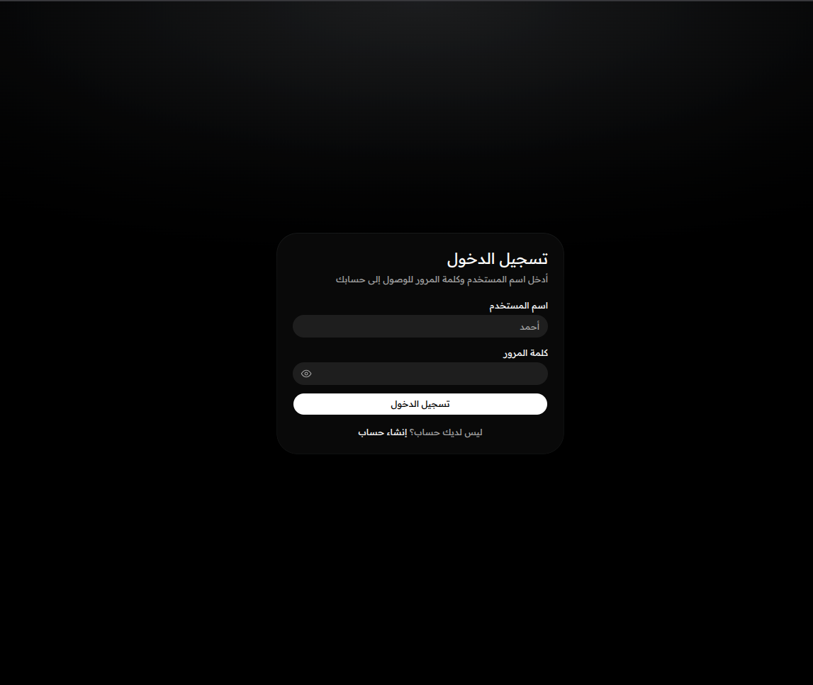
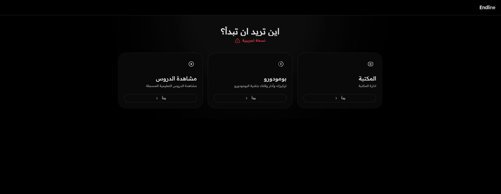
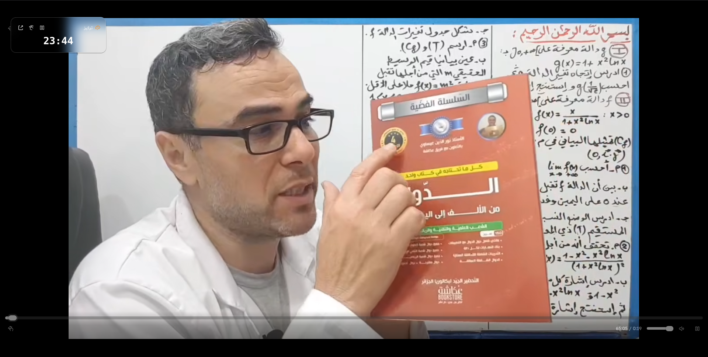
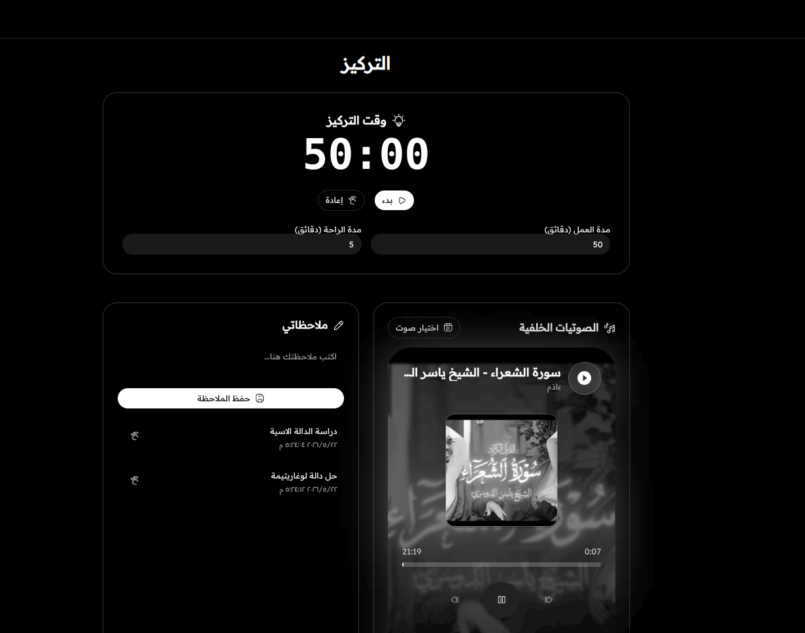
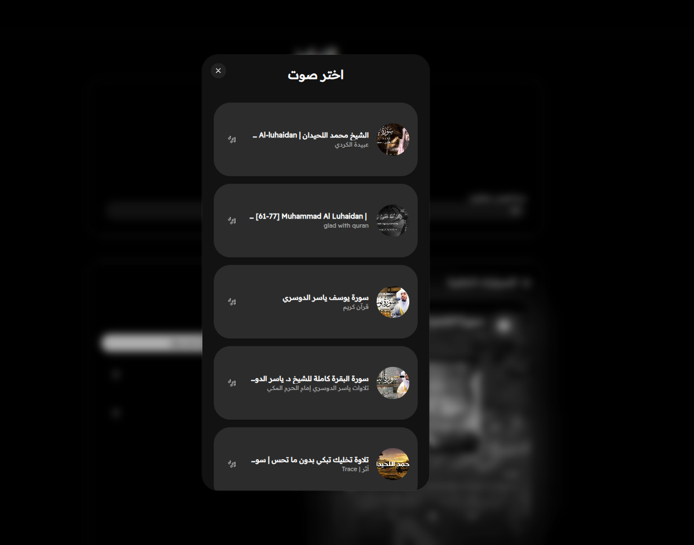
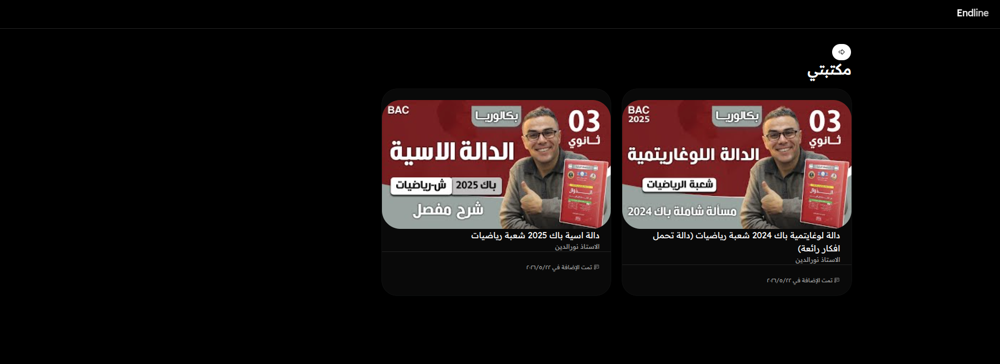

# Endline – Focused Learning Platform

Endline is a full‑stack web application that helps students study efficiently by combining video lessons (YouTube), a Pomodoro timer, note‑taking, and a personal library – all in one distraction‑free environment.


## Table of Contents

- [Features](#features)
- [Tech Stack](#tech-stack)
- [Architecture Overview](#architecture-overview)
- [Backend Setup](#backend-setup)
- [Frontend Setup](#frontend-setup)
- [Environment Variables](#environment-variables)
- [API Endpoints](#api-endpoints)
- [Database Schema](#database-schema)
- [Screenshots](#screenshots)
- [Deployment](#deployment)
- [License](#license)


### Core

- **User Authentication** – Secure login/register with JWT (access + refresh tokens). Refresh token stored in HTTP‑only cookie.
- **Custom YouTube Player** – No branding, no related videos, full custom controls (play/pause, seek, volume, fullscreen). Progress is saved locally and on the server.
- **Pomodoro Timer** – Work/break cycles with editable durations. Full‑screen focus mode hides distractions. State persists across page reloads (IndexedDB).
- **Background Sounds** – Large collection of Quran recitations (YouTube) shuffled each time. Hidden player with play/pause, seek, volume, and progress bar. Blurred thumbnail background.
- **Note Taking** – Save, view, and delete notes tied to videos or sessions. Stored in IndexedDB.
- **Video Library** – Save favourite videos from search results to a personal collection (backend storage).
- **Search** – Full‑text search over a built‑in catalogue (`videos.json`) with random result order.

### User Interface

- Fully responsive, RTL‑ready layout (Arabic support).
- Dark / light theme (using `next‑themes`).
- Smooth animations (Framer Motion).

## Tech Stack

| Category          | Technology                                 |
|-------------------|--------------------------------------------|
| Backend           | Go 1.21+, Fiber, GORM, PostgreSQL          |
| Frontend          | Next.js 16 (App Router), TypeScript        |
| Styling           | Tailwind CSS, shadcn/ui                    |
| Animation         | Framer Motion                              |
| YouTube Player    | react‑youtube (custom wrapper)             |
| Icons             | Hugeicons React                            |
| Authentication    | JWT (access + refresh), Argon2id           |
| Local Storage     | IndexedDB (timer state, notes, video progress) |
| HTTP Client       | Fetch API with automatic token refresh     |

## Architecture Overview


The backend is a REST API written in Go, using Fiber as the web framework and GORM for ORM. PostgreSQL stores user accounts, refresh tokens, video metadata, and user‑video relationships.

The frontend is a Next.js app (App Router) that communicates with the backend via a custom API client. Authentication uses an access token (stored in memory/localStorage) and a refresh token (HTTP‑only cookie). The client automatically refreshes the access token when it expires.

Video playback is handled by a custom YouTube player wrapper that hides all YouTube branding. The Pomodoro timer, notes, and sound player use IndexedDB for offline persistence.

## Backend Setup

### Prerequisites

- Go 
- PostgreSQL 

### Installation

1. Clone the repository:

```bash
git clone https://github.com/mohammed-ayoub-dz/endline.git
cd  endline
```

2. Install Go dependencies:

```bash
go mod tidy
```

3. Create the database:

```sql
CREATE DATABASE endline;
```

4. Copy environment variables:

```bash
cp .env.example .env
```

Edit `.env` with your database credentials and secrets.

5. Run the server:

```bash
go run cmd/server/main.go
```

The server will start on `http://localhost:8080`.

## Frontend Setup

### Prerequisites

- Bun.js 

### Installation


2. Install dependencies:

```bash
npm install
```

3. Create `.env.local`:

```env
NEXT_PUBLIC_API_URL=http://localhost:8080/api
```

4. Run the development server:

```bash
npm run dev
```

Open `http://localhost:3000`.

## Environment Variables

### Backend (.env)

| Variable         | Description                             | Default      |
|------------------|-----------------------------------------|--------------|
| DB_HOST          | PostgreSQL host                         | localhost    |
| DB_USER          | Database user                           | postgres     |
| DB_PASSWORD      | Database password                       | (empty)      |
| DB_NAME          | Database name                           | endline      |
| DB_PORT          | PostgreSQL port                         | 5432         |
| DB_SSLMODE       | SSL mode (disable / require)            | disable      |
| ACCESS_SECRET    | Secret for access tokens (≥32 chars)    | required     |
| REFRESH_SECRET   | Secret for refresh tokens (≥32 chars)   | required     |
| ACCESS_TTL       | Access token lifetime (e.g. 15m)        | 15m          |
| REFRESH_TTL      | Refresh token lifetime (e.g. 720h)      | 720h         |
| PORT             | Server listen port                       | 8080         |

### Frontend (.env.local)

| Variable               | Description                         | Default                      |
|------------------------|-------------------------------------|------------------------------|
| NEXT_PUBLIC_API_URL    | Backend API base URL                | http://localhost:8080/api    |

## API Endpoints

All endpoints are prefixed with `/api`.

### Public

| Method | Endpoint           | Description                     |
|--------|--------------------|---------------------------------|
| POST   | `/auth/register`   | Create a new user              |
| POST   | `/auth/login`      | Login, returns access token    |
| POST   | `/auth/refresh`    | Get new access token (cookie)  |
| POST   | `/auth/logout`     | Invalidate refresh token       |

### Protected (require `Authorization: Bearer <token>`)

| Method | Endpoint                     | Description                           |
|--------|------------------------------|---------------------------------------|
| GET    | `/protected/profile`         | Get current user profile              |
| POST   | `/protected/user/videos`     | Save a video to user's library        |
| GET    | `/protected/user/videos`     | Get all saved videos for the user     |
| POST   | `/protected/progress`        | Update watched time for a video       |
| GET    | `/protected/progress/:videoId` | Get saved progress for a video      |
| GET    | `/protected/videos/search?q=` | Search videos in `videos.json`      |

## Database Schema (Simplified)

### `users`

| Column     | Type      | Description               |
|------------|-----------|---------------------------|
| id         | SERIAL PK |                           |
| username   | TEXT UNIQUE| Login name                |
| password   | TEXT      | Argon2id hash             |
| points     | INT       | Default 0                 |
| level      | TEXT      | Default 'beginner'        |

### `videos`

| Column      | Type      | Description               |
|-------------|-----------|---------------------------|
| id          | SERIAL PK |                           |
| title       | TEXT      |                           |
| description | TEXT      |                           |
| url         | TEXT UNIQUE| YouTube URL               |
| thumbnail   | TEXT      |                           |

### `user_videos` (library)

| Column   | Type      | Description |
|----------|-----------|-------------|
| user_id  | INT FK    |             |
| video_id | INT FK    |             |
| added_at | TIMESTAMP |             |

### `video_progress`

| Column          | Type      | Description               |
|-----------------|-----------|---------------------------|
| id              | SERIAL PK |                           |
| user_id         | INT FK    |                           |
| video_id        | INT FK    |                           |
| watched_seconds | INT       |                           |
| completed       | BOOLEAN   |                           |

## Screenshots

### Login Page



### Dashboard



### Custom Video Player (Focus Mode)



### Pomodoro Timer (Focus Mode)



### Sound Selection Dialog



### Library Page



## Deployment

### Backend (Production)

- Set `DB_SSLMODE=require` and use a strong `ACCESS_SECRET` / `REFRESH_SECRET`.
- Compile the binary:

```bash
go build -o endline-api cmd/server/main.go
```

- Run behind a reverse proxy (nginx) with HTTPS.
- Use systemd or a process manager to keep the server alive.

### Frontend (Production)

- Build the static files:

```bash
npm run build
```

- Deploy to Vercel, Netlify, or a Node.js hosting provider.
- Set the `NEXT_PUBLIC_API_URL` environment variable to the production backend URL.


**Enjoy focused learning with Endline!**
